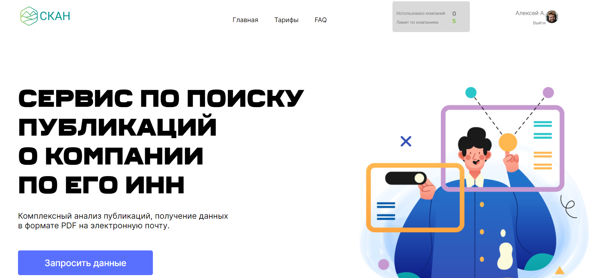
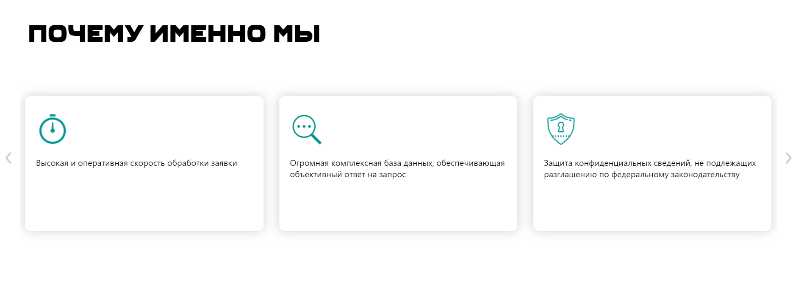
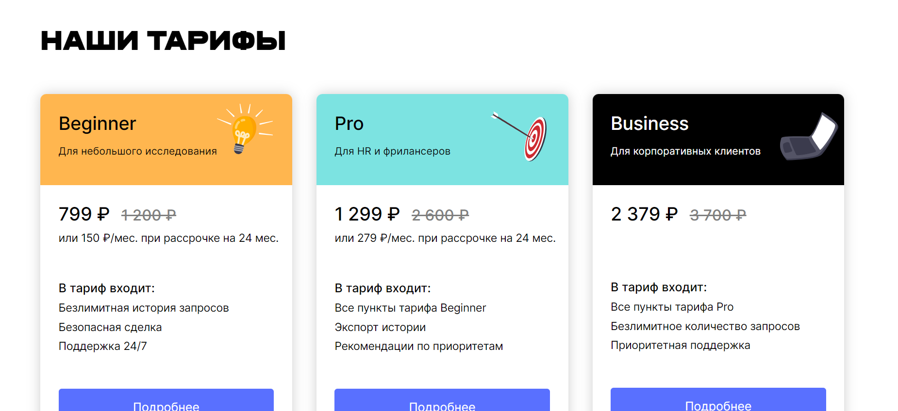
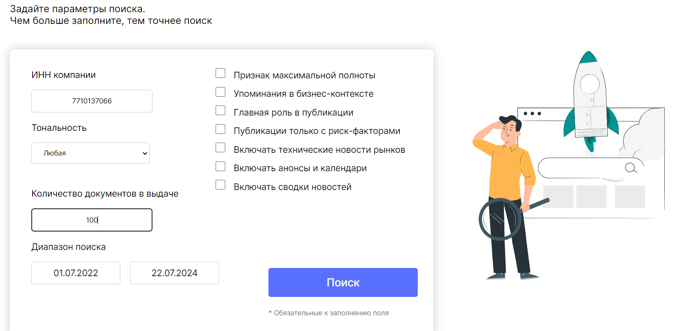
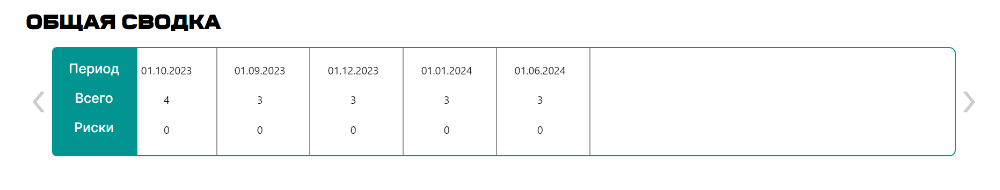
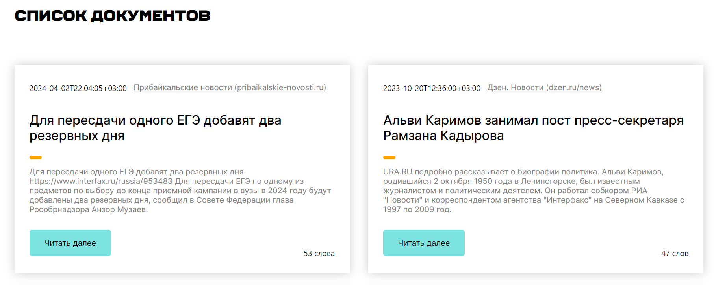

# My Diploma project "SCAN"

Этот проект представляет собой реализацию сайта для Компания «СКАН». Этот сайт помогает бизнесу формировать репутацию в интернете. Она предоставляет возможности не только мониторить СМИ и коммуницировать с журналистами, но и проверять своих контрагентов. Именно из последней услуги и вырос проект, который я реализовал.

## Технологии

- Javascript
- CSS
- HTML
- Typescript
- React

## Части сайта

### Главная страница

### Слайдер

Реализовал его с помощью библиотеки swiper.js

### Тарифы

### Данные для поиска

Вводим данные, и если всё правильно - нас перекидывает на страницу с документами.

### Ещё один слайдер уже на странице с документами

### Документы

Выдаётся 10 документом, но можем подгружать ещё при нажатии на кнопку.

### Страница авторизации

